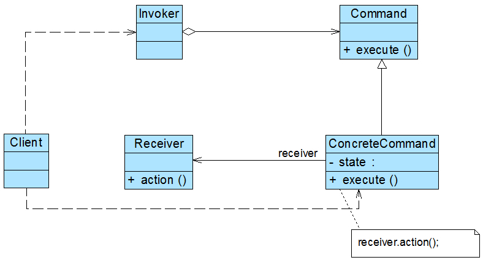

## 23 Design Pattern Explain

    > Design Pattern

       1. **Creational**
       * Singleton
       * Simple Factory
       * Factory Method
       * Abstract Factory
       * Prototype
       * Builder

       2. **Structural**
       * Adapter
       * Bridge
       * Composite
       * Decorator
       * Facade
       * Flyweight
       * Proxy

       3. **Behavioral**
       * Chain of Responsibility
       * Command 
       * Interpreter
       * Iterator
       * Mediator
       * Memento
       * Observer
       * State
       * Strategy
       * Template Method
       * Visitor