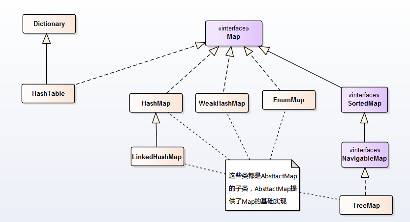
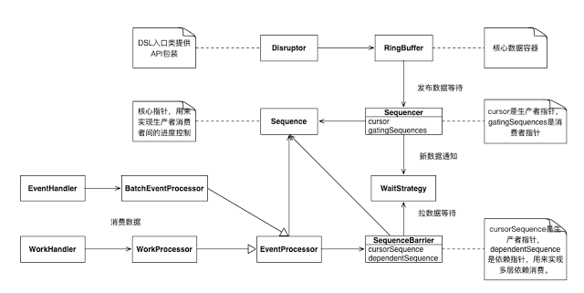
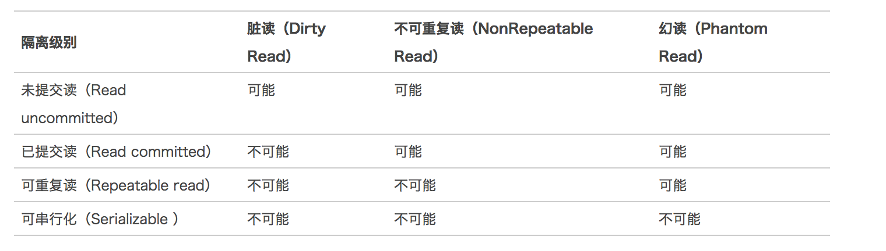

## My Java Pratice

   _All code of my java pratice_

**Modules** :

 > message-service  
   *  rabbitmq
   *  kafka

 > thread
   *  join , wait , notify , notifyAll , yield , sleep
   * Synchronize , lock , AbstractQueuedSynchronizer , ReentrantLock , ReentrantReadWriteLock
   * ExecutorService , FutrueTask , CompletableFuture , Callable , ThreadPoolExecutor
   * ConcurrentHashMap , ConcurrentLinkedQueue

 > data struct

   

   

   * heap , stack , map , collections

 > IO/NIO
   * MappedByteBuffer , RandomAccessFile

 > Design Pattern

   1. **Creational**
   * Singleton
   * Simple Factory
   * Factory Method
   * Abstract Factory
   * Prototype
   * Builder

   2. **Structural**
   * Adapter
   * Bridge
   * Composite
   * Decorator
   * Facade
   * Flyweight
   * Proxy

   3. **Behavioral**
   * Chain of Responsibility
   * Command
   * Interpreter
   * Iterator
   * Mediator
   * Memento
   * Observer
   * State
   * Strategy
   * Template Method
   * Visitor

 > AOP
   * Proxy , InvocationHandler
   * Asm ,Javassist , Cglib

 > JVM
   * ClassLoader
   * Gc algorithm
   * Heap area , Stack area , Method area ,
   * Jvm configure parameter

 > Spring
   *  Ioc
   *  Spring Aop
   *  Spring Transaction

 > Concurrent framework
   * LMAX Disruptor
        

 > MyBatis

 > MySQL

   *  index type & principle
   1. B-Tree
   2. Hash
   3. Fulltext (全文索引)
   4. SPATIAL  (空间索引）
   一级索引 、 二级索引
   聚簇索引 、非聚簇索引

   * transaction
   1. Read uncommited
   2. Read commited
   3. Repeatable read (Innodb Default)
   4. Serializable

    

   * lock
   1. 行级锁定
   2. 表级锁定
   3. 页级锁定

   * Sharding
   * cluster
   * SQL optimization （Where using index ）

 > Redis
   * hashes , lists, sets , sorted sets , Bitmaps
   * clusters
   * transaction
   * commands

 > Dubbo

 > Common lib