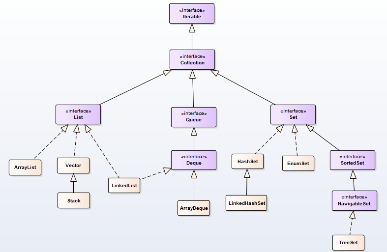

## My Java Pratice

   _All code of my java pratice_

**Modules** :

 > message-service
   *  rabbitmq
   *  kafka

 > language-tip
   * final , static , abstract
   * reflect , classloader

 > thread
   * join , wait , notify , notifyAll , yield , sleep , volatile
   * Synchronize , lock , AbstractQueuedSynchronizer , ReentrantLock , ReentrantReadWriteLock
   * ExecutorService , FutrueTask , CompletableFuture , Callable , ThreadPoolExecutor
   * ConcurrentHashMap , ConcurrentLinkedQueue

 > data struct

   

   

   * heap , stack , map , collections , list , tree , graph

 > IO/NIO
   * MappedByteBuffer , RandomAccessFile

 > AOP
   * Proxy , InvocationHandler
   * Asm ,Javassist , Cglib

 > JVM
   * ClassLoader
   * Gc algorithm
   * Heap area , Stack area , Method area ,
   * Jvm configure parameter

 > Spring
   *  Ioc , The process of bean initial
   *  Spring Aop
   *  Spring Transaction

 > Concurrent framework
   * LMAX Disruptor
        
   * SkipList

 > Netty & Actor

 > MyBatis

 > MySQL

   *  index type & principle
   1. B-Tree
   2. Hash
   3. Fulltext (全文索引)
   4. SPATIAL  (空间索引）
   一级索引 、 二级索引
   聚簇索引 、非聚簇索引

   * transaction
   1. Read uncommited
   2. Read commited
   3. Repeatable read (Innodb Default)
   4. Serializable

   

   * lock
   1. 行级锁定
   2. 表级锁定
   3. 页级锁定

   * Sharding
   * cluster
   * SQL optimization （Where using index ）

 > Redis
   * hashes , lists, sets , sorted sets , Bitmaps
   * clusters
   * transaction
   * commands

 > Dubbo

 > Zookeeper

 > Common lib

 > Docker

 > Etcd

 > Nginx
   * https unload
   * lua
   * binding

 > algorithm
   * Bloomfilter