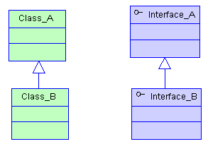
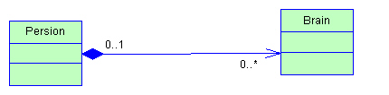
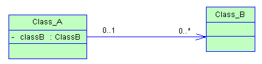

## UML Explain

  > UML Class Diagram
    1. **泛化关系(generalization)**
      指的是一个类（称为子类、子接口）继承另外的一个类（称为父类、父接口）的功能，并可以增加它自己的新功能的能力，继承是类与类或者接口与接口之间最常见的关系；在Java中此类关系通过关键字extends明确标识
        

      2. **实现关系(realize)**
      指的是一个class类实现interface接口（可以是多个）的功能；实现是类与接口之间最常见的关系；在Java中此类关系通过关键字implements明确标识
        

      3. **聚合关系(aggregation)**
      聚合是关联关系的一种特例，他体现的是整体与部分、拥有的关系，即has-a的关系，此时整体与部分之间是可分离的，他们可以具有各自的生命周期，部分可以属于多个整体对象，也可以为多个整体对象共享；比如计算机与CPU、公司与员工的关系等；表现在代码层面，和关联关系是一致的，只能从语义级别来区分
        

      4. **组合关系(composition)**
      组合也是关联关系的一种特例，他体现的是一种contains-a的关系，这种关系比聚合更强，也称为强聚合；他同样体现整体与部分间的关系，但此时整体与部分是不可分的，整体的生命周期结束也就意味着部分的生命周期结束；比如你和你的大脑；表现在代码层面，和关联关系是一致的，只能从语义级别来区分；
        

      5. **关联关系(association)**
      他体现的是两个类、或者类与接口之间语义级别的一种强依赖关系，比如我和我的朋友；这种关系比依赖更强、不存在依赖关系的偶然性、关系也不是临时性的，一般是长期性的，而且双方的关系一般是平等的、关联可以是单向、双向的；表现在代码层面，为被关联类B以类属性的形式出现在关联类A中，也可能是关联类A引用了一个类型为被关联类B的全局变量
        

      6. **依赖关系(dependency)**
      可以简单的理解，就是一个类A使用到了另一个类B，而这种使用关系是具有偶然性的、、临时性的、非常弱的，但是B类的变化会影响到A；比如某人要过河，需要借用一条船，此时人与船之间的关系就是依赖；表现在代码层面，为类B作为参数被类A在某个method方法中使用
        

  > UML Sequence Diagram